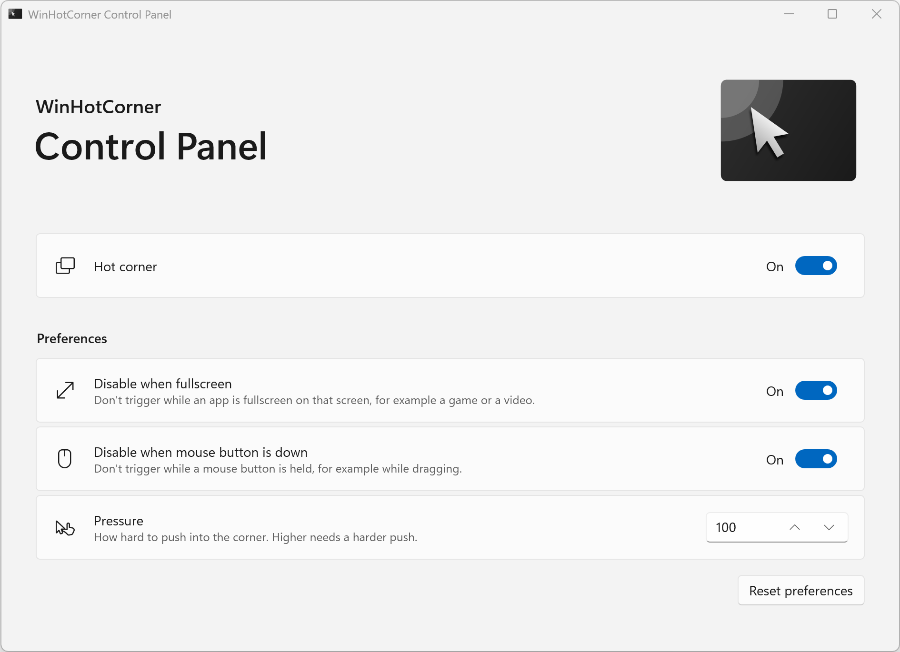

<table>
<tbody>
  <tr>
    <td> </td>
    <td>
    
  # WinHotCorner
  </td>
  </tr>
</tbody>
</table>

Classic GNOME hot corner function for Windows!

## What it does

Push the mouse pointer into the top-left corner of a screen and Task View opens, just like the Activities overview on GNOME. No keyboard needed.

It feels like GNOME too: the corner reacts to a deliberate push, not to the pointer just passing by, and it waits until you move away before it can trigger again.

## Philosophy

- **Simple**: works out of the box, nothing to set up (but you can).
- **Lightweight**: small, with no window, no tray icon and no shortcuts.
- **Elegant**: blends into Windows, as if it were a Windows feature.

## Install

Download **one** installer from [Releases](https://github.com/swinzy/WinHotCorner/releases):

| Installer | Installs | |
|---|---|---|
| **`WinHotCorner-Full-<version>-setup.exe`** | the hot corner **and** the control panel | Recommended |
| **`WinHotCorner-HotCornerOnly-<version>-setup.exe`** | the hot corner only (about 2 MB) | If you don't want the control panel |

You never need both: *Full* already contains the hot corner. If you installed *HotCornerOnly* and want the control panel later, just run *Full*: it adds the control panel and leaves the hot corner as it is (it only updates it if *Full* is newer).

The hot corner starts right away and from then on whenever you sign in. In *Installed apps* the two parts appear as *WinHotCorner* and *WinHotCorner Control Panel*.

The installers are not signed yet, so Windows may show a SmartScreen warning: choose *More info* → *Run anyway*.

**Requirements**: Windows 10 version 1903 or later, or Windows 11; 64-bit.

## Settings

Open **WinHotCorner Control Panel** from the Start menu to:

- turn the hot corner off or on,
- keep it from triggering while an app is fullscreen on that screen (games, videos), or while a mouse button is held (dragging),
- change how hard you have to push into the corner.

Changes apply immediately. Without the control panel, the hot corner works with its defaults; settings can also be set in the registry or by Group Policy, see the [technical notes](docs/technical.md#configuration).

## Turning it off or removing it

- **Turn it off**: switch *Hot corner* off in the control panel. It stays off, also after signing in again.
- **Remove it**: *Settings* → *Apps* → *Installed apps* → *WinHotCorner* (and *WinHotCorner Control Panel*) → *Uninstall*.

## Multiple screens

Every screen whose top-left corner is free (no other screen directly to its left or above it) has a hot corner. On a side-by-side setup, that is the left screen.

## Troubleshooting

**It does not trigger while Task Manager or another app running as administrator is in front.**
WinHotCorner runs with your highest privileges so that this works. On a standard (non-administrator) account it cannot, because Windows does not let normal programs control administrator windows.

**Something else is wrong.**
Errors are written to `%LOCALAPPDATA%\WinHotCorner\WinHotCorner.log`. Please attach it to an [issue](https://github.com/swinzy/WinHotCorner/issues).

## How it works

See the [technical notes](docs/technical.md): how a push is detected, configuration, startup, the installers and how to build.

Planned work is in [TODO.md](https://github.com/swinzy/WinHotCorner/blob/devel/TODO.md) (on the `devel` branch, where development happens).
