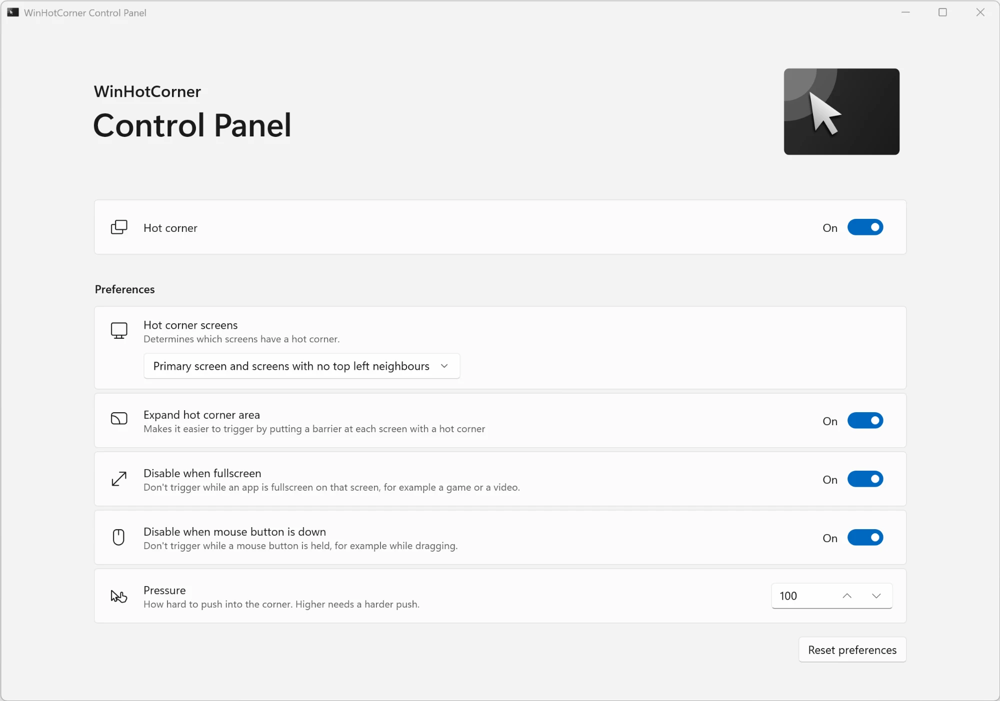

<table>
<tbody>
  <tr>
    <td> </td>
    <td>
    
  # WinHotCorner
  </td>
  </tr>
</tbody>
</table>

Classic GNOME hot corner function for Windows!

## What it does

Push the mouse pointer into the top-left corner of a screen and Task View opens, just like the Activities overview on GNOME.

> [!TIP]
> - It only reacts to a deliberate push, not to the pointer just passing by.
> - Fully supports multi-screen setups

## Philosophy

- **Simple**: works out of the box, nothing to set up (but you can).
- **Lightweight**: small, with no window, no tray icon and no shortcuts.
- **Elegant**: blends into Windows, as if it were a Windows feature.

## Install

Download **one** installer from [Releases](https://github.com/swinzy/WinHotCorner/releases):

| Installer | Installs | |
|---|---|---|
| **`WinHotCorner-Full-<version>-setup.exe`** | the hot corner **and** the control panel | Recommended |
| **`WinHotCorner-HotCornerOnly-<version>-setup.exe`** | the hot corner only (about 2 MB) | If you don't want the control panel |

> [!TIP]
> You can always add the **control panel** to a **hot corner only** install by running the **full** installer (yes we thought of that).

The hot corner starts right away and whenever you sign in.

By default, Setup signs WinHotCorner on your computer, so it runs without administrator rights and its ripple shows above Task View; see [Signing WinHotCorner on your computer](docs/digital-signature.md).

> [!IMPORTANT]
> The installers themselves are not signed, so Windows may show a SmartScreen warning: choose *More info* → *Run anyway*.
>
> This is on purpose. Trusted certificates cost money, and the more open source developers get one, even a free one, the easier it becomes for Windows to require them one day, as Google has started to do on [Android](https://developer.android.com/developer-verification).
>
> Read more about [why WinHotCorner itself is not signed](docs/digital-signature.md#why-winhotcorner-itself-is-not-signed).

Windows 10 version 1903 or later, or Windows 11, 64-bit. In English, 简体中文, 繁體中文 and Español.

## Settings

Open **WinHotCorner Control Panel** from the Start menu to:

- turn the hot corner off or on,
- choose which screens have a hot corner (by default, as on GNOME: the primary screen and every screen with no other screen at its top left),
- hold the pointer at a corner with another screen next to it (*Expand hot corner area*, on by default),
- keep it from triggering while an app is fullscreen on that screen, or while a mouse button is held,
- change how hard you have to push into the corner.

Changes apply immediately. Settings can also be set in the registry or by Group Policy, see the [technical notes](docs/technical.md#configuration).

To remove it: *Settings* → *Apps* → *Installed apps* → *WinHotCorner* (and *WinHotCorner Control Panel*) → *Uninstall*.

## Troubleshooting

Errors are written to `%LOCALAPPDATA%\WinHotCorner\WinHotCorner.log`. Please attach it to an [issue](https://github.com/swinzy/WinHotCorner/issues).

## How it works

See the [technical notes](docs/technical.md). Planned work is in [TODO.md](https://github.com/swinzy/WinHotCorner/blob/devel/TODO.md) (on the `devel` branch, where development happens).
